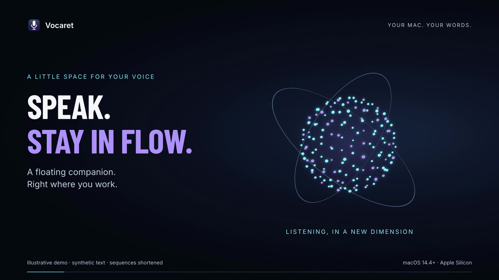

<p align="center">
  
</p>

<h1 align="center">Vocaret</h1>

<p align="center">
  <strong>Local-first speech-to-text for macOS.</strong><br>
  Hold a key, speak, let go — your words appear where your cursor is.<br>
  Speak your language, including Czech, English, and German. Local by default; cloud only when selected.
</p>

<p align="center">
  
  
  
  
</p>

<p align="center">
  <a href="https://honzacuhel.github.io/vocaret/"><strong>Project website · Installation &amp; usage guide →</strong></a>
</p>

<p align="center">
  <a href="https://honzacuhel.github.io/vocaret/#demo">
    
  </a>
</p>

<p align="center">
  <a href="https://honzacuhel.github.io/vocaret/#demo"><strong>▶ Watch the 36-second product film →</strong></a>
</p>

> **Status: v0.2.2.** An early Apple Silicon release, tested on one Mac. Read
> [the current limitations](#limitations) before installing.


## Floating companion

A translucent native panel with a voice-reactive **3D particle sphere** keeps
recording controls near your work. It hides after six seconds of idle time;
hovering, recording, meetings, unsent assistant text and memory editing keep it
visible. Reopen it with **Show floating panel** in the menu bar.

- **Dictate** inserts at the cursor with `⌃⌥D`.
- **Remember** opens your last dictation as an editable, local memory draft.
  Nothing is sent to an agent. Only **Save memory** writes the document.
- **Ask assistant** continues from your last dictation, with retained conversation
  context. Review the request and press Send to use your signed-in Codex or Claude
  CLI. Its microphone adds text to the composer; the global shortcut still dictates
  into your working app.
- **Meeting** shows live, local microphone + system-audio transcription.

Codex and Claude share Vocaret's own memory document when explicitly invoked.
They can **propose** edits; you review and save them. This does not edit their
private memory databases or attach to an existing agent task. Ordinary dictation
never invokes these agents or automatically modifies memory.

Spotify, Music and YouTube can pause during recording and resume afterward.
YouTube needs browser Automation and JavaScript permissions. See
[setup and verification](docs/floating-companion.md) and
[privacy details](PRIVACY.md#floating-conversation-and-agent-memory).

## What it does

- **Dictation anywhere** — hold `⌃⌥D`, speak, and release to insert text at the
  cursor. A quick tap toggles recording.
- **Multilingual dictation** — language is detected per utterance, including
  Czech, English, German, and other languages supported by the selected engine.
- **Local or live** — use local Whisper/Parakeet, or bring a Soniox key for live
  words with automatic local fallback.
- **Meeting transcription** — `⌃⌥M` captures microphone and system audio as
  `Me` / `Them`, without a virtual audio driver. Local transcription runs during
  the call, with live speaker-labelled passages in the Meetings window.
- **Useful extras** — optional local Qwen or GPT-5 nano cleanup, searchable history, speaking
  metrics, meeting summaries, and automatic Spotify/Music/YouTube pause and resume.
- **Focused overlay** — see microphone level and the latest three live lines,
  including long sentences without punctuation. The complete transcript is
  preserved for insertion and history.

Whisper, Parakeet, and Qwen through llama.cpp run locally. Soniox is an explicit
opt-in for live audio; GPT-5 nano is a separate opt-in that receives transcript
text for formatting. See [PRIVACY.md](PRIVACY.md) for the exact data flow.

## Requirements

- **Apple Silicon** Mac (M1 or newer)
- **macOS 14.4+**
- Xcode or the Command Line Tools, to build
- ~1.6 GB for the default speech model; ~2.4 GB more for optional cleanup

## Install

Download the [Vocaret 0.2.2 Apple Silicon DMG](https://github.com/HonzaCuhel/vocaret/releases/download/v0.2.2/Vocaret-0.2.2-macOS-arm64.dmg)
from the [release page](https://github.com/HonzaCuhel/vocaret/releases/tag/v0.2.2).
Open it and drag Vocaret into Applications. This build is **ad-hoc signed and not
notarized**; macOS may require explicit approval in Privacy & Security. There is
no automatic updater. Speech models download separately on first use.

To build and install from source:

```bash
git clone https://github.com/HonzaCuhel/vocaret.git
cd vocaret
./scripts/build_app.sh --install
```

This builds, installs, and launches `~/Applications/Vocaret.app`. Vocaret then
lives in the menu bar.

Optional local cleanup:

```bash
./scripts/setup_llm.sh
```

### First run

The default Whisper model downloads on first launch. macOS asks for permissions
only when a feature needs them:

| Permission | When | Needed for |
|---|---|---|
| **Microphone** | first dictation | recording your voice |
| **Accessibility** | first insertion | typing the text at your cursor |
| **System Audio Recording** | first meeting | hearing other participants |
| **Automation (Spotify / Music / browser)** | playback control | pausing and resuming supported media |

YouTube also requires **Allow JavaScript from Apple Events** in the supported
browser: Chrome, Safari, Edge or Brave.

Without Accessibility, transcripts are copied to the clipboard instead of
being inserted.

## Usage

| Action | Shortcut |
|---|---|
| Dictate (hold, speak, release) | `⌃⌥D` |
| Dictate (tap to start, tap to stop) | `⌃⌥D` short tap |
| Cancel | `Esc` |
| Meeting transcription start/stop | `⌃⌥M` |

Open the menu-bar window for history, meetings, metrics, shortcut recording, and
settings. The menu also exposes the latest dictation if insertion fails.

### Soniox live setup

1. Create a Soniox project and copy its API key.
2. In **Settings → Transcription**, select **Soniox Live** and paste the key.
3. Select the matching region: US keys use **United States**; EU processing
   requires an EU project key and **European Union**.
4. Connect. Settings shows current-month realtime cost, requests, and duration.

Soniox is optional and paid. Select Whisper or Parakeet for fully local use.
Automatic detection is unrestricted by default, including German. Choose a
fixed language or a restricted set under **Settings → Detection languages**
when needed; previously saved restrictions are preserved. Selected languages use Soniox's
[strict language hints](https://soniox.com/docs/stt/concepts/language-restrictions)
to reduce accidental switches; recognition is still best-effort.
Use **All supported languages** to remove a saved restriction. If the live
connection fails, the panel reports it while microphone recording continues;
the retained audio is transcribed locally after you release the shortcut.
Stalled audio sends time out after 10 seconds, and finalization after 5 seconds.

### AI cleanup

In **Settings → AI cleanup**, enable dictation cleanup and choose:

- **Local Qwen3 4B** — private and offline; run `scripts/setup_llm.sh` first.
- **GPT-5 nano** — paste your OpenAI API key for fast cloud formatting. Audio
  is never sent to OpenAI, responses use `store: false`, and failures fall back
  to the original transcript. See the provider’s
  [model page](https://developers.openai.com/api/docs/models/gpt-5-nano) for pricing.

Cleanup removes fillers, accidental repetition and abandoned starts in the
spoken language. Explicit changes of mind replace the superseded detail:
“The budget is 100 dollars, actually 30 dollars” becomes “The budget is 30 dollars.”
Independent amounts, conditions and negations are preserved. This is model-based
editing; check important details before sending the text.

History, **Copy Last**, the final preview and insertion use the same result after
cleanup and personal spelling corrections. If formatting is unavailable or its
output fails validation, the original transcript is retained with a visible
notice and is not marked as AI formatted. GPT-5 nano uses low reasoning effort;
its request timeout grows from 12 to 45 seconds with transcript length.

## Meeting privacy

Meeting mode records everyone on the call. Tell participants first and follow
the law in your jurisdiction; the legal responsibility is yours. Raw audio is
deleted after transcription by default. Wear headphones to prevent the other
side from appearing in both tracks.

## Configuration

The Settings tab covers shortcuts, language, engine, cleanup, vocabulary, and
behavior. Advanced options are also available through `defaults`:

```bash
defaults write com.jancuhel.vocaret whisperModel openai_whisper-large-v3-v20240930_626MB
defaults write com.jancuhel.vocaret asrEngine parakeet   # or: whisper
defaults write com.jancuhel.vocaret sonioxRegion eu      # or: us
defaults write com.jancuhel.vocaret asrEngine soniox
defaults write com.jancuhel.vocaret dictationCleanupModel gpt-5-nano # or: local
defaults write com.jancuhel.vocaret autoLanguages -array de en
defaults write com.jancuhel.vocaret keepRecordings -bool true
defaults write com.jancuhel.vocaret keepDictationHistory -bool false
defaults write com.jancuhel.vocaret keepModelLoaded -bool false
```

Restart Vocaret after changing defaults.

## Limitations

- Beta DMG is ad-hoc signed, not notarized. No auto-update; rebuilt ad-hoc apps can require renewed permissions.
- Tested on one Apple Silicon Mac, not broad hardware or macOS combinations.
- Meeting labels are `Me` / `Them`, not full speaker diarization.
- Auto mode detects all engine-supported languages by default; set `autoLanguages`
  only when you want to restrict detection to a chosen set.
- This is a personal project. Issues are welcome, but support is not guaranteed.

## Performance

Meetings prepare the local speech model as recording starts and transcribe
completed utterances during the call. Natural pauses release passages early;
sustained speech is split into windows of at most 12 seconds. The final wait
covers queued passages and optional local AI notes. On a slow machine or a cold
model, a bounded queue can fall back to the WAV recording after the call.
The Meetings library and selected document load off the UI thread.


Warm Whisper dictation typically finishes in about one second; Parakeet is
faster on clean speech. Soniox streams partial text; GPT-5 nano formats only
after transcription. Both use network and paid API credit. For the lightest
local setup, use the 626 MB Whisper model, set `keepModelLoaded false`, and
disable cleanup.

## Uninstall

```bash
rm -rf ~/Applications/Vocaret.app
rm -rf ~/Library/Application\ Support/Vocaret
rm -rf ~/Documents/Vocaret
defaults delete com.jancuhel.vocaret
security delete-generic-password -s com.jancuhel.vocaret.api-key -a soniox
security delete-generic-password -s com.jancuhel.vocaret.api-key -a openai
```

Then remove Vocaret from System Settings → Privacy & Security → Accessibility,
Microphone and System Audio Recording.

## Development

```bash
swift test
swift build
.build/debug/Vocaret --transcribe audio.wav [--language auto|cs|en|de|…]
open -W -a ~/Applications/Vocaret.app --args --selftest all 8 --out /tmp/selftest.log
.build/release/Vocaret --coach
.build/release/Vocaret --render-companion /tmp/companion # synthetic glass panel previews
.build/release/Vocaret --render-window /tmp/ui
.build/release/Vocaret --render-meetings /tmp/meeting-ui # synthetic light/dark previews
.build/release/Vocaret --selftest meeting-stream # cached Whisper + synthetic speech; no capture
open -W -n -a build/Vocaret.app --args --selftest meeting-live 8 --out /tmp/meeting-live.log
```

An ad-hoc signature can require granting Accessibility again. To preserve the
grant, sign with your Apple Development certificate:

```bash
CODESIGN_IDENTITY="Apple Development: you@example.com (TEAMID)" ./scripts/build_app.sh --install
```

Do not weaken the signing requirement in `scripts/build_app.sh`.

## Troubleshooting

- **Hotkey does nothing** — launch the menu-bar app or record another shortcut.
- **Text lands on the clipboard instead of being typed** — grant Accessibility
  again; after an ad-hoc rebuild, toggle Vocaret off and on.
- **`llama-server not found`** — run `scripts/setup_llm.sh` or leave cleanup off.
- **Meeting has no `Them` lines** — check System Settings → Privacy & Security →
  Screen & System Audio Recording.
- **Logs** — `log stream --predicate 'subsystem == "com.jancuhel.vocaret"' --level info`

## License

[Apache-2.0](LICENSE). Third-party components and model licenses:
[THIRD-PARTY-NOTICES.md](THIRD-PARTY-NOTICES.md).
