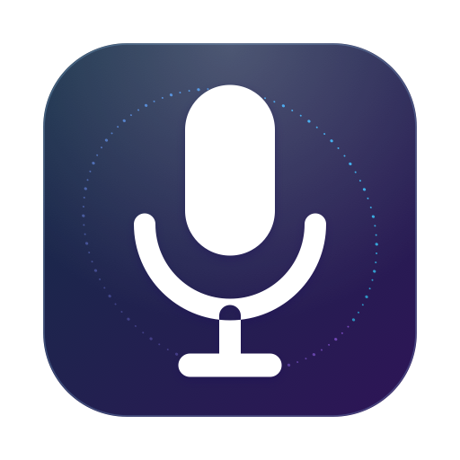

<p align="center">
  
</p>

<h1 align="center">Vocaret</h1>

<p align="center">
  <strong>Local-first speech-to-text for macOS.</strong><br>
  Hold a key, speak, let go — your words appear where your cursor is.<br>
  Czech and English, mixed freely. Local by default; optional live cloud mode.
</p>

<p align="center">
  
  
  
  
</p>

<p align="center">
  <a href="https://honzacuhel.github.io/vocaret/"><strong>Project website · Installation &amp; usage guide →</strong></a>
</p>

> **Status: v0.2.0, early.** Used daily on one Mac; expect rough edges and read
> [the current limitations](#limitations) before installing.

## What it does

- **Dictation anywhere** — hold `⌃⌥D`, speak, and release to insert text at the
  cursor. A quick tap toggles recording.
- **Czech and English together** — language is detected per utterance.
- **Local or live** — use local Whisper/Parakeet, or bring a Soniox key for live
  words with automatic local fallback.
- **Meeting transcription** — `⌃⌥M` captures microphone and system audio as
  `Me` / `Them`, without a virtual audio driver.
- **Useful extras** — optional local cleanup, searchable history, speaking
  metrics, meeting summaries, and automatic Spotify/Music pause and resume.
- **Focused overlay** — see microphone level and up to four recent live lines
  without leaving the app where you are typing.

Whisper, Parakeet, and llama.cpp run locally. Soniox is explicit opt-in and
sends live audio to the selected EU or US endpoint. See [PRIVACY.md](PRIVACY.md)
for the exact data flow and retention behavior.

## Requirements

- **Apple Silicon** Mac (M1 or newer)
- **macOS 14.4+**
- Xcode or the Command Line Tools, to build
- ~1.6 GB for the default speech model; ~2.4 GB more for optional cleanup

## Install

Vocaret is distributed as source:

```bash
git clone https://github.com/HonzaCuhel/vocaret.git
cd vocaret
./scripts/build_app.sh --install
```

This builds, installs, and launches `~/Applications/Vocaret.app`. Vocaret then
lives in the menu bar.

Optional local cleanup:

```bash
./scripts/setup_llm.sh
```

### First run

The default Whisper model downloads on first launch. macOS asks for permissions
only when a feature needs them:

| Permission | When | Needed for |
|---|---|---|
| **Microphone** | first dictation | recording your voice |
| **Accessibility** | first insertion | typing the text at your cursor |
| **System Audio Recording** | first meeting | hearing other participants |
| **Automation (Spotify / Music)** | first recording while music plays | pausing and resuming your music |

Without Accessibility, transcripts are copied to the clipboard instead of
being inserted.

## Usage

| Action | Shortcut |
|---|---|
| Dictate (hold, speak, release) | `⌃⌥D` |
| Dictate (tap to start, tap to stop) | `⌃⌥D` short tap |
| Cancel | `Esc` |
| Meeting transcription start/stop | `⌃⌥M` |

Open the menu-bar window for history, meetings, metrics, shortcut recording, and
settings. The menu also exposes the latest dictation if insertion fails.

### Soniox live setup

1. Create a Soniox project and copy its API key.
2. In **Settings → Transcription**, select **Soniox Live** and paste the key.
3. Select the matching region: US keys use **United States**; EU processing
   requires an EU project key and **European Union**.
4. Connect. Settings shows current-month realtime cost, requests, and duration.

Soniox is optional and paid. Select Whisper or Parakeet for fully local use.

## Meeting privacy

Meeting mode records everyone on the call. Tell participants first and follow
the law in your jurisdiction; the legal responsibility is yours. Raw audio is
deleted after transcription by default. Wear headphones to prevent the other
side from appearing in both tracks.

## Configuration

The Settings tab covers shortcuts, language, engine, cleanup, vocabulary, and
behavior. Advanced options are also available through `defaults`:

```bash
defaults write com.jancuhel.vocaret whisperModel openai_whisper-large-v3-v20240930_626MB
defaults write com.jancuhel.vocaret asrEngine parakeet   # or: whisper
defaults write com.jancuhel.vocaret sonioxRegion eu      # or: us
defaults write com.jancuhel.vocaret asrEngine soniox
defaults write com.jancuhel.vocaret autoLanguages -array de en
defaults write com.jancuhel.vocaret keepRecordings -bool true
defaults write com.jancuhel.vocaret keepDictationHistory -bool false
defaults write com.jancuhel.vocaret keepModelLoaded -bool false
```

Restart Vocaret after changing defaults.

## Limitations

- Source-only and not notarized; there is no signed download or auto-update.
- Tested on one Apple Silicon Mac, not broad hardware or macOS combinations.
- Meeting labels are `Me` / `Them`, not full speaker diarization.
- Auto mode defaults to Czech and English; configure `autoLanguages` for others.
- This is a personal project. Issues are welcome, but support is not guaranteed.

## Performance

Warm Whisper dictation typically finishes in about one second; Parakeet is
faster on clean speech. Soniox streams partial text but uses network and paid
API credit. For the lightest local setup, use the 626 MB Whisper model, set
`keepModelLoaded false`, and disable cleanup.

## Uninstall

```bash
rm -rf ~/Applications/Vocaret.app
rm -rf ~/Library/Application\ Support/Vocaret
rm -rf ~/Documents/Vocaret
defaults delete com.jancuhel.vocaret
security delete-generic-password -s com.jancuhel.vocaret.api-key -a soniox
```

Then remove Vocaret from System Settings → Privacy & Security → Accessibility,
Microphone and System Audio Recording.

## Development

```bash
swift test
swift build
.build/debug/Vocaret --transcribe audio.wav [--language auto|cs|en]
open -W -a ~/Applications/Vocaret.app --args --selftest all 8 --out /tmp/selftest.log
.build/release/Vocaret --coach
.build/release/Vocaret --render-window /tmp/ui
```

An ad-hoc signature can require granting Accessibility again. To preserve the
grant, sign with your Apple Development certificate:

```bash
CODESIGN_IDENTITY="Apple Development: you@example.com (TEAMID)" ./scripts/build_app.sh --install
```

Do not weaken the signing requirement in `scripts/build_app.sh`.

## Troubleshooting

- **Hotkey does nothing** — launch the menu-bar app or record another shortcut.
- **Text lands on the clipboard instead of being typed** — grant Accessibility
  again; after an ad-hoc rebuild, toggle Vocaret off and on.
- **`llama-server not found`** — run `scripts/setup_llm.sh` or leave cleanup off.
- **Meeting has no `Them` lines** — check System Settings → Privacy & Security →
  Screen & System Audio Recording.
- **Logs** — `log stream --predicate 'subsystem == "com.jancuhel.vocaret"' --level info`

## License

[Apache-2.0](LICENSE). Third-party components and model licenses:
[THIRD-PARTY-NOTICES.md](THIRD-PARTY-NOTICES.md).
